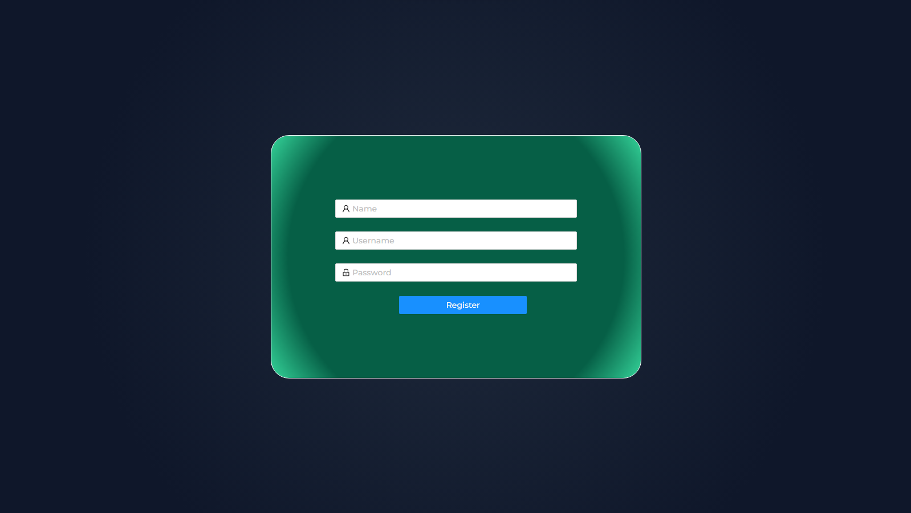
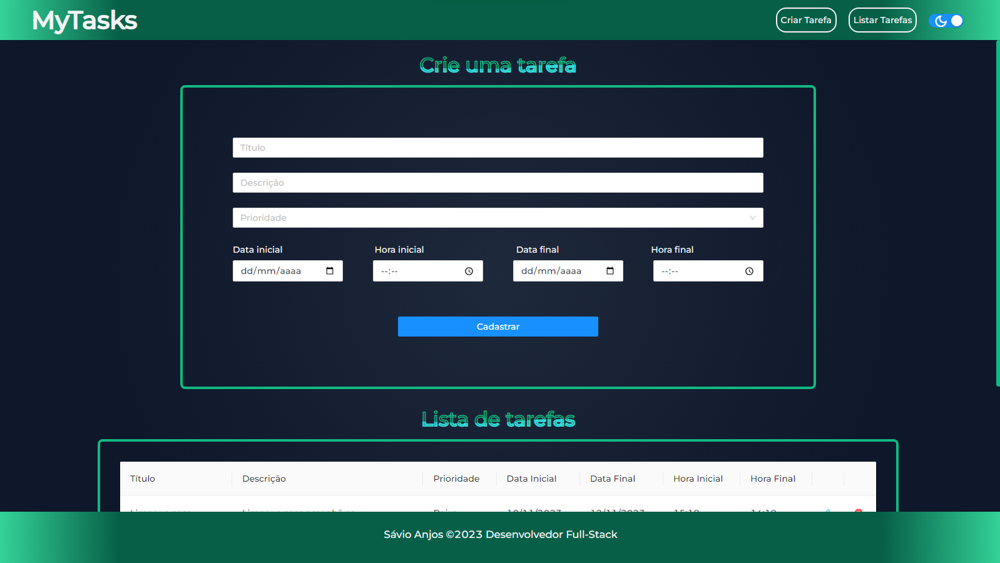
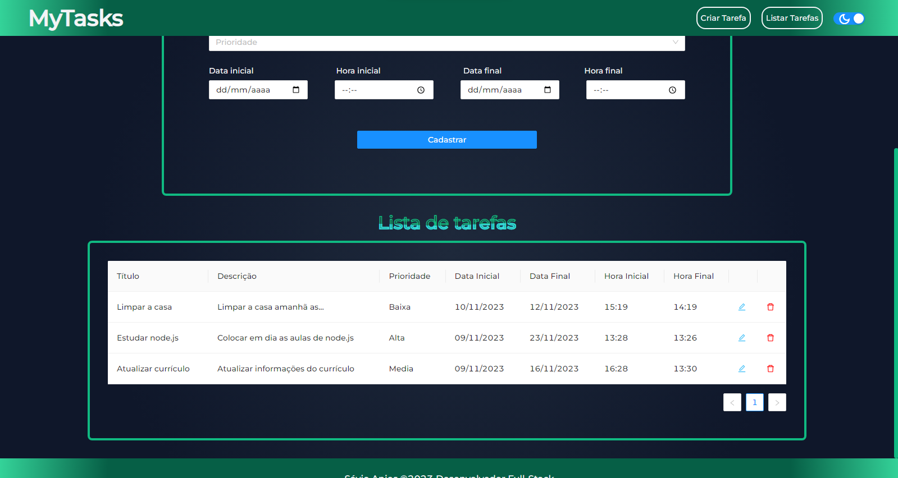

<p align='center'></p>

 <p align='center'>


  
</p>

## 🚀 Tecnologias

Esse projeto está utilizando as seguintes tecnologias:

- [Angular](https://angular.io/)
- [AntDesign](https://ng.ant.design/docs/introduce/en)
- [Cypress](https://www.cypress.io/)

## 📜 Descrição

Esse projeto é um desafio pessoal que fiz para reforçar os conhecimentos em Angular e TypeScript, nele utilizei todos os principais conceitos e as principais funcionalidades do Angular.

Esse projeto está utilizando essa: - [API](https://github.com/Savio-Anjos/JAVA-Todo-List)

## ⚙️ Como funciona?

- O usuário deve se cadastrar para utilizar as funcionalidades;
- Após o cadastro as informações são salvas para manter o usuário logado;
- O usuário pode criar uma tarefa;
- O usuário pode listar as próprias taferas;
- O usuário pode atualizar as próprias taferas;
- O usuário pode deletar as próprias taferas;

## 🎲 Quer customizar o projeto?

### Clone esse repositório

```bash
git clone https://github.com/Savio-Anjos/MyTasks.git
```

### Navegue até o diretório do projeto

```bash
cd MyTasks
```

### Instale as dependências

```bash
npm i
```

```bash
yarn
```

### Inicie a aplicação

```bash
ng serve
```

## 🖼️ Layout

### Register



### Create Tasks



### List Tasks



---

<p>Criado com 💙 por <a href='https://github.com/Savio-Anjos/' target='_blank'>Sávio Anjos</a></p>
